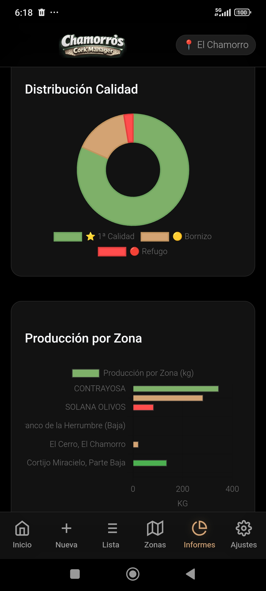

<h1 align="center">Chamorro's Cork Manager</h1>

  

  <b>Solución profesional para la gestión financiera, operativa y digitalización de sacas de corcho</b>

---

### Descripción General

Chamorro's Cork Manager es una plataforma avanzada diseñada para la optimización integral de explotaciones corcheras. En su versión 6.1.5, el sistema se posiciona como una herramienta de inteligencia de negocio que permite un control técnico, operativo y económico exhaustivo en tiempo real a través de una interfaz de alta eficiencia.

---

### Módulos Principales

#### Panel de Control y Monitorización
Visualización centralizada de la producción activa. El sistema ofrece un desglose inmediato de kilogramos y unidades de medida regionales (Quintales) clasificados por calidades: Primera, Bornizo y Refugo.

  

#### Gestión Técnica y Catastral (SIGPAC)
Administración detallada de parcelas mediante la integración de datos oficiales. La aplicación procesa documentos catastrales para extraer referencias, superficies gráficas y tablas de aprovechamiento técnico por subparcela.

  

#### Control de Operaciones y Trazabilidad
Registro exhaustivo de pesadas con trazabilidad completa. Permite el seguimiento de cada saca individual, incluyendo gestión de históricos, auditoría de pesos y clasificación automatizada por calidad.

  

#### Inteligencia Financiera y Gestión de Gastos
Control riguroso de los costes de explotación. El sistema permite el registro de gastos operativos (mano de obra, logística, maquinaria) y calcula automáticamente el beneficio neto real de la campaña.

  

#### Administración Multi-Finca
Soporte para múltiples explotaciones independientes. Cada finca cuenta con su propia configuración técnica, acuerdos comerciales y base de datos de producción.

  
  

#### Análisis e Informes Avanzados
Generación de documentación profesional con cabeceras duales (Vendedor/Comprador). Incluye herramientas de análisis visual mediante gráficas dinámicas y exportación nativa a PDF y Excel.

  
  

  
  

---

### Especificaciones Técnicas

*   Arquitectura: Capacitor para despliegue multiplataforma nativo (Android e iOS).
*   Motor de Datos: IndexedDB con persistencia local de alta velocidad.
*   Interfaz: Dark UI optimizada para condiciones de campo y paneles OLED.
*   Exportación: Motores especializados para generación de documentos técnicos en alta resolución.
*   Operación: Funcionamiento offline total con sincronización automática mediante Service Workers.

---

### Configuración y Seguridad

El sistema permite una personalización corporativa completa, incluyendo datos legales del emisor y receptor, factores de conversión y porcentajes de merma técnica (Oreo). Dispone de un sistema de copias de seguridad cifradas para garantizar la integridad de la información.

  

---

### Licencia y Propiedad

Este software es de uso exclusivo familiar y privado. Todos los derechos reservados por Sdog Farm Software Factory.

Sdog Farm Software Factory - Innovación y digitalización para el sector primario.

---

### Contacto y Soporte

Para asistencia técnica o consultas sobre la plataforma, puede contactar a través de la siguiente dirección:
Correo electrónico: soporte.sdogfarm@gmail.com
