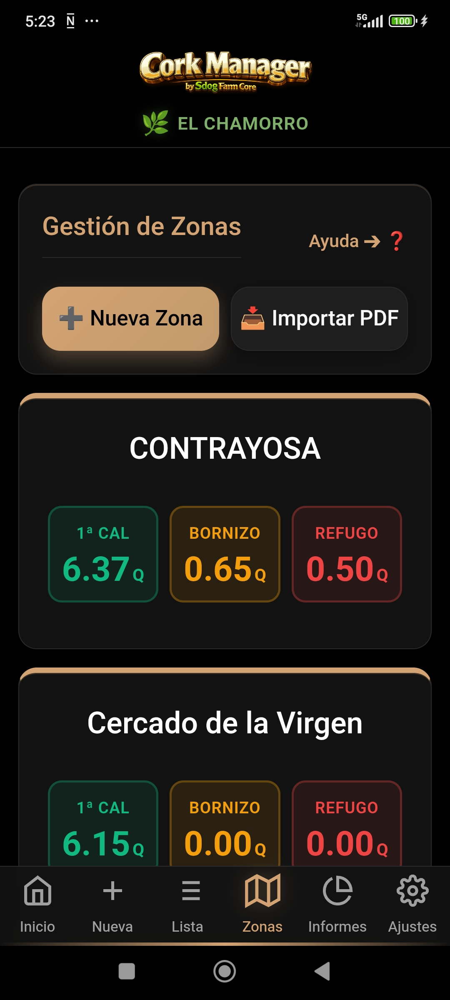

  

<strong>Built with:</strong> TypeScript · HTML5 · CSS3 · Capacitor (PWA-ready)

<strong>License:</strong> Proprietary — Sdog Farm Software Factory. All rights reserved.

---

## Descripción completa

Cork Manager es una aplicación multiplataforma diseñada para gestionar de forma integral la producción y la parte económica de explotaciones corcheras. A continuación se describen en detalle las funcionalidades de cada módulo/screen: qué hace, qué datos maneja y casos de uso principales. Tras cada descripción funcional, se muestran las capturas de pantalla relacionadas.

---

## Módulos y funcionalidades

### 1) Panel de control (Dashboard)
Descripción funcional:
- Vista inicial que muestra indicadores clave: total kg/pesadas diarias, quintales por calidad (1ª, Bornizo, Refugo), y balance acumulado por campaña.
- Accesos rápidos a: Nueva Pesada, Listado de Pesadas, Informes y Gestión de Fincas.
- Filtros por finca y rango de fechas para contextualizar los datos mostrados.
- Objetivo: ofrecer una foto inmediata del estado operativo y financiero para la toma de decisiones sobre recolección y logística.

Casos de uso:
- Comprobación rápida del rendimiento diario en campo.
- Monitorizar desviaciones por calidad o merma técnica.

Imágenes relacionadas:

  

<strong>Figura:</strong> Panel principal / Dashboard con resumen de producción.

---

### 2) Registro de pesadas (Nueva Pesada)
Descripción funcional:
- Formulario optimizado para captura en campo: campos principales (Bruto, Tara, Calidad), cálculo automático de Neto y conversión a Quintales.
- Selección de comprador, asignación de saca y número identificador único por pesada.
- Campos opcionales: foto de la saca, notas de observación, coordenadas GPS si el dispositivo las proporciona.
- Validaciones: límites razonables en pesos, comprobación de valores obligatorios y guardado offline en IndexedDB si no hay conexión.
- Objetivo: máxima velocidad y fiabilidad en la entrada de datos para evitar manipulación posterior.

Casos de uso:
- Registro inmediato tras el pesaje en báscula.
- Corregir entradas en el listado con auditoría de cambios.

Imágenes relacionadas:

  

<strong>Figura:</strong> Formulario "Nueva Pesada" (entrada rápida en campo).

---

### 3) Listado y trazabilidad de pesadas
Descripción funcional:
- Listado tabular de todas las pesadas con paginación y filtros por finca, comprador, calidad, fecha y rango de pesos.
- Operaciones sobre registros: ver detalle, editar (con registro de auditoría), marcar como verificada, y eliminación (con confirmación y control de permisos).
- Exportación de subconjuntos a Excel para conciliaciones y auditorías.
- Objetivo: disponer de histórico accesible y exportable para trazabilidad y gestión administrativa.

Imágenes relacionadas:

  

<strong>Figura:</strong> Listado de pesadas con filtros y controles de edición.

---

### 4) Gestión de fincas y compradores
Descripción funcional:
- Panel para gestionar múltiples fincas: datos legales (DNI/CIF), dirección completa, responsables, contacto telefónico y e-mail.
- Per-file settings por finca: factores de conversión, merma técnica por defecto, moneda y preferencias de exportación.
- Gestión de compradores: perfil de comprador con precios por calidad (1ª, Bornizo, Refugo), condiciones comerciales y datos fiscales.
- Objetivo: centralizar la información administrativa y comercial por explotación.

Imágenes relacionadas:

  

<strong>Figura:</strong> Gestión de fincas con datos legales y contacto.

---

### 5) Gestión catastral (SIGPAC) y zonas
Descripción funcional:
- Importación de fichas SIGPAC y asociación a fincas/subparcelas.
- Almacenamiento de metadatos: referencia catastral, polígono, superficie y tablas de aprovechamiento técnico.
- Herramientas para restaurar fichas y evitar la pérdida accidental de información; validaciones antes de eliminar parcelas.
- Objetivo: asegurar la consistencia técnica de las superficies y su vinculación con la producción.

Imágenes relacionadas:

  

<strong>Figura:</strong> Importación y restauración de fichas SIGPAC.

  

<strong>Figura:</strong> Visor de zonas catastrales y subparcelas.

---

### 6) Gestión de gastos y control económico
Descripción funcional:
- Registro de gastos operativos vinculado a finca o campaña: mano de obra, transporte, maquinaria, insumos y otros costes.
- Clasificación por tipo de gasto y posibilidad de asociar al lote o a una serie de pesadas.
- Cálculo automático de coste unitario por quintal y generación de un informe económico consolidado.
- Objetivo: obtener visibilidad real del coste de explotación y márgenes por comprador.

Imágenes relacionadas:

  

<strong>Figura:</strong> Registro y asignación de gastos por campaña.

  

<strong>Figura:</strong> Pantalla de ajustes y configuración del sistema.

---

### 7) Informes y análisis
Descripción funcional:
- Generación de informes: balance de sacas, informe por zonas, histórico de liquidaciones e informe económico con cabeceras vendedor/comprador.
- Motor de gráficas dinámicas para análisis temporal y por calidad.
- Exportación nativa a PDF y Excel con formato profesional y logo configurable en cabecera.
- Objetivo: facilitar la documentación técnica y comercial para compradores, auditorías y presentaciones.

Imágenes relacionadas:

  
   
  

<strong>Figura:</strong> Informes de balance y por zonas; exportación a PDF/XLSX.

  
   
  

<strong>Figura:</strong> Histórico de sacas y resumen económico por campaña.

  

<strong>Figura:</strong> Gráficas dinámicas para análisis estadístico.

---

## Operación offline y sincronización

- Almacenamiento local en IndexedDB con cola de cambios para sincronizar cuando haya conexión.
- Estrategia de fusión para minimizar conflictos; registro de última modificación y usuario.

---

## Seguridad y copias de seguridad

- Copias de seguridad cifradas y exportables. Recomendación: realizar backups periódicos tras jornadas de pesada.
- Control de accesos y permisos para evitar eliminaciones accidentales o cambios sin auditoría.

---

## Instalación y despliegue

Requisitos básicos: Node.js, npm, Capacitor. Pasos resumidos:

1. npm install
2. npm run build
3. npx cap add android
4. npx cap sync
5. npx cap open android (Compilar y firmar desde Android Studio/Xcode)

---

## Estructura de datos y exportación

- IndexedDB: tablas/objetos principales (fincas, parcelas, pesadas, compradores, gastos).
- Exportación: XLSX para tablas y PDF para informes formateados.

---

  
<strong>Desarrollado por</strong>

  
  
<em>Ecosistema CORE de Gestión Inteligente</em>

  <h3>📄 Licencia y Soporte</h3>
  
© 2026 Cork Manager. Todos los derechos reservados. 
  Licencia de uso profesional v7.0.0

  
Para soporte técnico o consultas comerciales: 
  📩 <a href="mailto:soporte.sdogfarm@gmail.com">soporte.sdogfarm@gmail.com</a>

---

## 🆕 Novedades en la versión 7.0.1 (Fixes & Estabilidad)

* **Corrección de Configuración Proguard**: Actualizado `build.gradle` del plugin `@capacitor/app` para usar `proguard-android-optimize.txt`. Esto resuelve el error de compilación en versiones recientes del Android Gradle Plugin (AGP 8.0+) que impedía el uso de `proguard-android.txt` debido a la restricción de `-dontoptimize`.
* **Sincronización de Dependencias**: Verificada la consistencia de las directivas Proguard en todos los módulos de Capacitor para garantizar optimizaciones R8 seguras.

## 🆕 Novedades en la versión 7.0.0 (CloudSync & Google Drive)

* **Sincronización en la Nube Automatizada**: Integración completa con Google Drive para salvaguardar todos los datos de la explotación (Fincas, Zonas, Pesadas y Gastos).
* **Restauración Instantánea**: Nuevo flujo en la pantalla de bienvenida que permite importar la última copia de seguridad sincronizada en Google Drive con un solo clic.
* **Bi-directional Merge**: El motor `CloudSync` es capaz de fusionar bases de datos locales y remotas evitando pérdida de información si la app es desinstalada o usada en múltiples dispositivos con la misma cuenta.
* **Autenticación Segura**: Integración con Google SignIn / OAuth 2.0 adaptado nativamente para entornos Android PWA/Capacitor.
* **Mejoras de UI**: Botón integrado para abrir el archivo directamente en Google Drive web.

## 🆕 Novedades en la versión 6.3.2 (Optimización de Rendimiento)

* **Paginación Inteligente**: Mejora drástica de los tiempos de carga en el listado de pesadas, renderizando bloques progresivos para evitar cuelgues en explotaciones con grandes volúmenes de datos.
* **Caché Matemático (Memoización)**: El motor interno de cálculo del Dashboard ahora memoriza y almacena en caché el sumatorio total de quintales, evitando la iteración profunda del historial completo si no han existido cambios recientes.
* **Spinners y Feedback Visual**: Integración de indicadores de carga en exportaciones complejas (Excel/PDF) y procesado de archivos catastrales SIGPAC.
* **Mejoras en Tablas y Reportes**: Las tablas de los informes ahora son responsivas (`scroll horizontal`) adaptándose al 100% en pantallas móviles pequeñas sin recortar datos. El PDF del panel de gráficos exporta el lienzo limpio en color blanco.

## 🆕 Novedades en la versión 6.3.1 (Refactorización Modular)

* **Arquitectura Modular (ES6)**: Se han eliminado las dependencias del ámbito global (`window.*`), dividiendo la lógica en módulos importables para mayor seguridad, rendimiento y mantenibilidad.
* **Empaquetador Vite**: Integración completa con Vite para la compilación, unificando dependencias, minificando el código fuente y optimizando el tamaño del proyecto.
* **Resolución de Assets**: Reestructuración del directorio de imágenes (`public/icons`) para garantizar su correcta resolución en la aplicación final compilada con Capacitor.
* **Exportación PDF**: Corrección de estilos CSS en los reportes (eliminación de fondos oscuros degradados en las listas) y restauración de la cabecera verde de "Propietario / Comprador".
* **Exportación Excel Nativa**: Se han reprogramado las exportaciones a Excel (Balance y Liquidación). En Android nativo, ahora se genera el archivo de forma interna en caché y se invoca directamente el menú de "Compartir" (Share API) garantizando su accesibilidad en todos los dispositivos móviles.

<em>Documento actualizado con estructura funcional y listado de novedades técnicas.</em>

