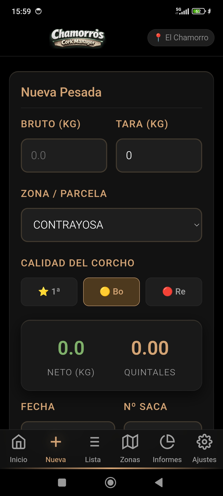
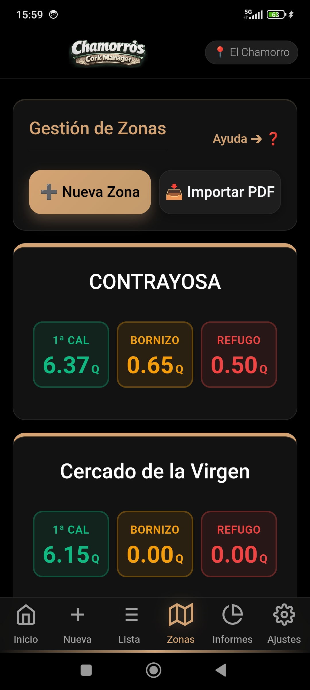
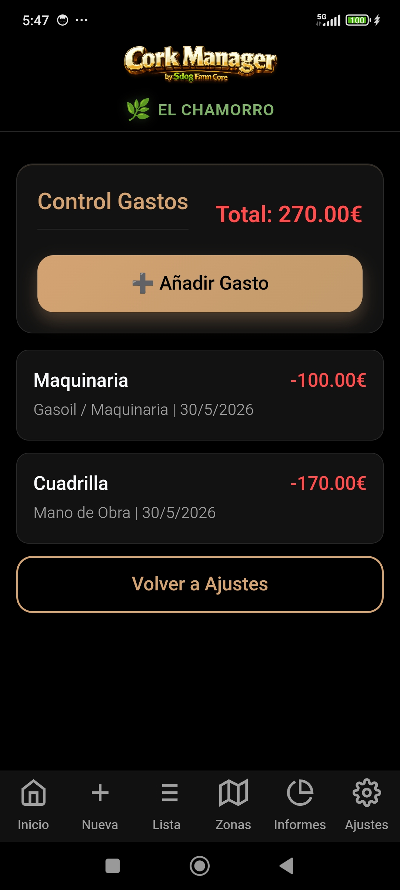
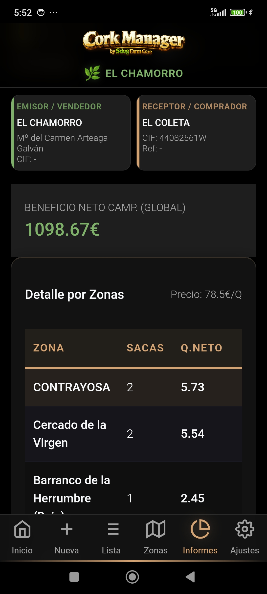
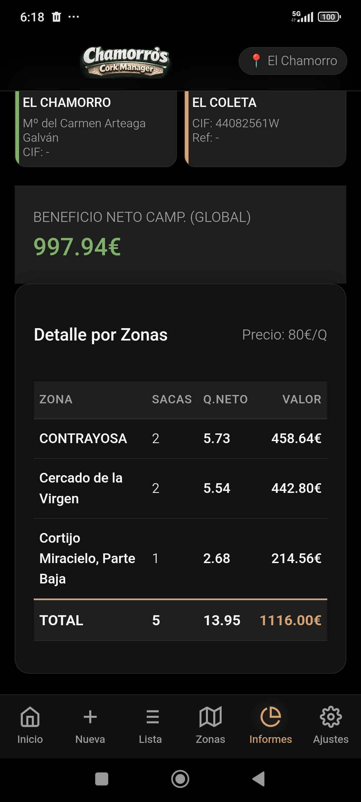
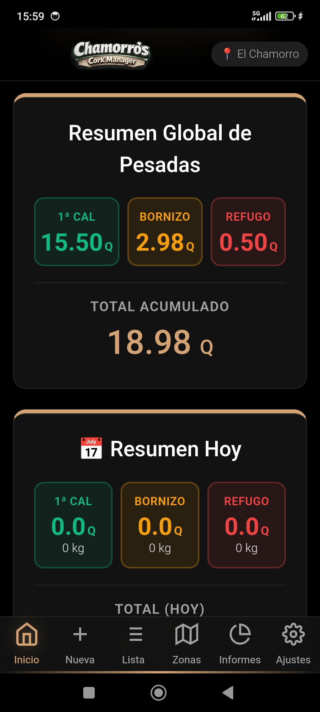

# Chamorro's Cork Manager

  

Solución profesional para la gestión financiera, operativa y la digitalización de sacas de corcho.

---

## Índice

- [Descripción general](#descripción-general)
- [Características clave](#características-clave-detaladas)
- [Instalación y despliegue](#instalación-y-despliegue)
- [Uso rápido](#uso-rápido-flujo-típico)
- [Estructura de datos](#estructura-de-datos-y-formatos)
- [Capturas y guía visual](#capturas-y-guía-visual)
- [Buenas prácticas](#buenas-prácticas-y-recomendaciones)
- [Licencia y soporte](#licencia-y-soporte)

---

## Descripción general

Chamorro's Cork Manager es una aplicación multiplataforma orientada a explotaciones corcheras que unifica la gestión técnica, operativa y económica de la campaña. Pensada para uso en campo y en oficina, ofrece:

- Registro y trazabilidad de pesadas por saca.
- Gestión catastral de parcelas (SIGPAC) e importación de fichas.
- Control de costes y gastos con informes financieros detallados.
- Informes profesionales exportables a PDF/Excel y gráficas dinámicas.
- Soporte offline con sincronización.

Versión documentada: v6.2.9 (con historial de mejoras desde v6.2.6).

---

## Características clave (detalladas)

1. Registro de pesadas
   - Entrada rápida de pesadas: bruto, tara, calidad, neto y conversión a quintales.
   - Clasificación por calidad: 1ª, Bornizo, Refugo.
   - Historial por saca y auditoría de modificaciones.
   - Captura de foto (opcional) y notas por pesada.

   
   **Figura:** Formulario "Nueva Pesada" (entrada rápida en campo).

2. Gestión de fincas y parcelas (SIGPAC)
   - Administración de múltiples fincas con datos legales (DNI/CIF, dirección, contacto).
   - Importación y restauración de fichas SIGPAC; gestión de subparcelas y superficies.
   - Evita la eliminación accidental de parcelas con validaciones y restauraciones.

   
   **Figura:** Gestión e importación de fichas SIGPAC.

3. Control de costes y gestión de gastos
   - Registro de gastos (mano de obra, logística, insumos, servicios) y su asignación por finca/parte.
   - Cálculo automático de coste unitario por quintal y margen por comprador.

   
   **Figura:** Registro y asignación de gastos por campaña.

4. Compradores y tarifas por calidad
   - Perfil completo de compradores con precios por calidad (1ª, Bornizo, Refugo).
   - Configuración de descuentos, impuestos y condiciones comerciales.

5. Informes y análisis
   - Informes: balance de sacas, histórico, por zonas, informe económico con cabecera vendedor/comprador.
   - Gráficas dinámicas para análisis de producción y rendimiento.
   - Exportación a PDF y Excel con formato profesional.

   
   

6. Panel de control y UX optimizada
   - Dashboard con resumen global y diario de producción por finca.
   - Interfaz optimizada para uso en pantallas oscuras (modo dark) y condiciones de campo.

   

7. Operación offline y sincronización
   - Almacenamiento local con IndexedDB.
   - Sincronización cuando hay conexión, diseñada para minimizar conflictos.

8. Seguridad y copia de seguridad
   - Copias de seguridad cifradas.
   - Gestión de permisos y datos de contacto del emisor y receptor.

---

## Instalación y despliegue

La aplicación está empaquetada con Capacitor y es compatible con Android e iOS. Flujo general:

1. Preparación del entorno: Node.js, Ionic/Capacitor.
2. Construir la app: `npm install` y `npm run build`.
3. Generar el proyecto nativo: `npx cap add android` / `npx cap add ios`.
4. Abrir el proyecto nativo y compilar desde Android Studio / Xcode.

(Estos pasos asumen acceso al código fuente y a las claves/firmas para distribución en tiendas.)

---

## Uso rápido (flujo típico)

1. Crear o seleccionar una finca.
2. Configurar compradores y precios por calidad.
3. Registrar pesadas en campo desde la pantalla "Nueva Pesada".
4. Revisar el listado de pesadas y ajustar si es necesario.
5. Registrar gastos asociados a la campaña.
6. Generar informes (balance, por zonas, histórico) y exportarlos.

---

## Estructura de datos y formatos

- Almacenamiento local: IndexedDB (objetos: fincas, parcelas, pesadas, compradores, gastos).
- Exportación: XLSX (tablas) y PDF (informe formateado con cabeceras y logos).

---

## Capturas y guía visual

Las imágenes se han movido a la carpeta `docs/`. Referencias incluidas en el README para formación rápida.

---

## Buenas prácticas y recomendaciones

- Mantener actualizados los precios por calidad antes de iniciar la campaña.
- Realizar copias de seguridad periódicas y comprobar la sincronización tras jornadas extensas.
- Revisar las tarifas y asignaciones de costes para obtener márgenes reales por explotación.

---

## Licencia y soporte

Software de uso privado/familiar propiedad de Sdog Farm Software Factory.

Contacto: soporte.sdogfarm@gmail.com

---

### Cambios y versiones

- v6.2.9: Optimización visual, campos de contacto y mejoras en formularios de pesada.
- v6.2.6: Reordenación de campos y validaciones de zonas/SIGPAC.

*Fin del README actualizado.*